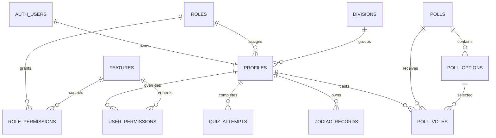

# Supabase database design

The executable migration is
[`supabase/migrations/202606290001_initial_schema.sql`](../supabase/migrations/202606290001_initial_schema.sql).

Key decisions:

- Passwords and sessions belong only to Supabase Auth. `profiles` never stores a
  password.
- `profiles.user_id` is the Auth UUID; `legacy_id` keeps compatibility with the
  existing integer-based Flutter model.
- Permissions are normalized by role, with optional per-user overrides.
- RLS restricts profiles, permissions, zodiac rows, quiz attempts, votes, and
  private profile media. Admin capability is evaluated server-side by
  `has_feature()`.
- Zodiac IDs use integer identities to interoperate with the existing Drift data
  class. Each record is still isolated by Auth UUID.
- Admin account creation is an Edge Function operation. Its service-role secret
  is never exposed to Flutter.

Currently connected from Flutter: Auth/session, account creation and listing,
profiles, role permissions, and real-time zodiac history. Quiz attempts, polls,
and Storage tables/policies are ready for a later UI persistence pass.
